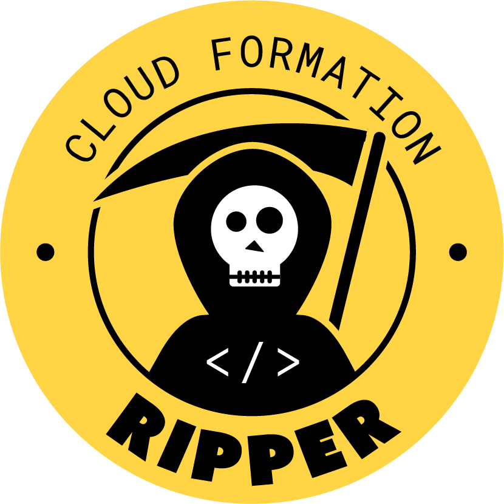

# CFRipper


[](https://badge.fury.io/py/cfripper)
[](https://lgtm.com/projects/g/Skyscanner/cfripper/alerts/)
[](https://lgtm.com/projects/g/Skyscanner/cfripper/context:python)

CFRipper is a Library and CLI security analyzer for AWS CloudFormation templates. You can use CFRipper to prevent deploying insecure AWS resources into your Cloud environment. You can write your own compliance checks by adding new custom plugins.

Docs and more details available in https://cfripper.readthedocs.io/

## CLI Usage

### Normal execution
```bash
$ cfripper /tmp/root.yaml /tmp/root_bypass.json --format txt
Analysing /tmp/root.yaml...
Not adding CrossAccountTrustRule failure in rootRole because no AWS Account ID was found in the config.
Valid: False
Issues found:
	- FullWildcardPrincipalRule: rootRole should not allow wildcards in principals (principal: '*')
	- IAMRolesOverprivilegedRule: Role 'rootRole' contains an insecure permission '*' in policy 'root'
Analysing /tmp/root_bypass.json...
Valid: True
```

### Using the "resolve" flag
```bash
$ cfripper /tmp/root.yaml /tmp/root_bypass.json --format txt --resolve
Analysing /tmp/root.yaml...
Not adding CrossAccountTrustRule failure in rootRole because no AWS Account ID was found in the config.
Valid: False
Issues found:
	- FullWildcardPrincipalRule: rootRole should not allow wildcards in principals (principal: '*')
	- IAMRolesOverprivilegedRule: Role 'rootRole' contains an insecure permission '*' in policy 'root'
Analysing /tmp/root_bypass.json...
Not adding CrossAccountTrustRule failure in rootRole because no AWS Account ID was found in the config.
Valid: False
Issues found:
	- IAMRolesOverprivilegedRule: Role 'rootRole' contains an insecure permission '*' in policy 'root'
Monitored issues found:
	- PartialWildcardPrincipalRule: rootRole contains an unknown principal: 123456789012
	- PartialWildcardPrincipalRule: rootRole should not allow wildcard in principals or account-wide principals 
(principal: 'arn:aws:iam::123456789012:root')
```

### Using json format and output-folder argument
```bash
$ cfripper /tmp/root.yaml /tmp/root_bypass.json --format json --resolve --output-folder /tmp
Analysing /tmp/root.yaml...
Not adding CrossAccountTrustRule failure in rootRole because no AWS Account ID was found in the config.
Result saved in /tmp/root.yaml.cfripper.results.json
Analysing /tmp/root_bypass.json...
Not adding CrossAccountTrustRule failure in rootRole because no AWS Account ID was found in the config.
Result saved in /tmp/root_bypass.json.cfripper.results.json
```