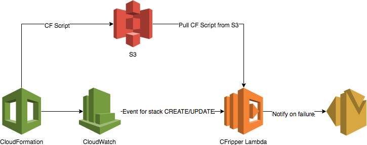
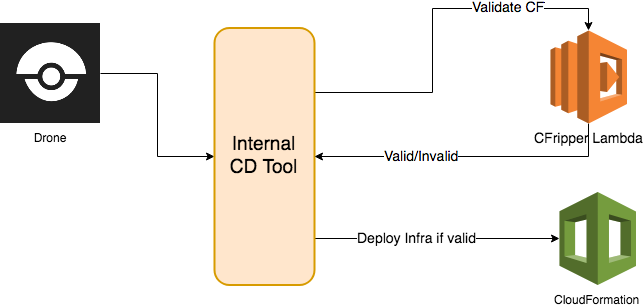

## Sample pipeline with CFRipper

As with the other security tools that we use at Skyscanner, CFRipper is part of the CI/CD pipeline. It runs just before a CloudFormation stack is deployed or updated and if the CloudFormation script fails to pass the security check it fails the deployment and notifies the team that owns the stack. This is an example of how you might set up CFRipper as an AWS Lambda:


Another approach that we use at Skyscanner is the Infrastructure as Code pipeline. Code is built and tested using drone and then our internal CD tool deals with calling CFRipper to validate the script and then trigger the deployment of the infrastructure provided that the CloudFormation script is valid:


```python
import logging

import pycfmodel

from cfripper.config.config import Config
from cfripper.config.pluggy.utils import get_all_rules
from cfripper.rule_processor import RuleProcessor

logger = logging.getLogger(__name__)


def handler(event, context):
    """
    Main entry point of the Lambda function.

    :param event: {
        "stack": {
            "name": str,
            "template": Dict,
            "parameters": Dict,
            "tags": Dict
        },
        "event": String,
        "region": String,
        "account": {
            "name": String,
            "id": String,
        },
        "user_agent": String,
    }
    :param context:
    :return:
    """
    try:
        config = Config(
            stack_name=event.get("stack", {}).get("name"),
            rules=get_all_rules(),
            event=event.get("event"),
            aws_region=event.get("region"),
            aws_account_name=event.get("account", {}).get("name"),
            aws_account_id=event.get("account", {}).get("id"),
            aws_user_agent=event.get("user_agent"),
        )

        processor = RuleProcessor(*[rule(config) for rule in config.rules.values()])

        cfmodel = pycfmodel.parse(event.get("stack", {}).get("template", {})).resolve(
            extra_params=event.get("stack", {}).get("parameters", {})
        )
        result = processor.process_cf_template(cfmodel=cfmodel, config=config)

        return {
            "valid": result.valid,
            "failures": [failure.serializable() for failure in result.get_failures()],
            "exceptions": [x.args[0] for x in result.exceptions],
        }
    except Exception:
        logger.exception("Error while running lambda")
        raise
```