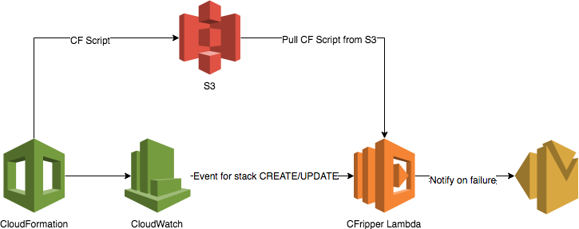

# CFripper

Lambda function to "rip apart" a CloudFormation template and check it for security compliance.

## Sample pipeline with CFripper

CFripper is a Python tool that aims to prevent vulnerabilities from getting to production infrastructure through vulnerable CloudFormation scripts. As with the other security tools that we use at Skyscanner, CFripper is part of the CI/CD pipeline. It runs just before a CloudFormation stack is deployed or updated and if the CloudFormation script fails to pass the security check it fails the deployment and notifies the team that owns the stack. This is an example of how you might set up CFripper as an AWS Lambda:

Another approach that we use at Skyscanner is the Infrastructure as Code pipeline. Code is built and tested using drone and then our internal CD tool deals with calling CFripper to validate the script and then trigger the deployment of the infrastructure provided that the CloudFormation script is valid:

## Lambda Installation

To install the lambda first generate the zip package using `make lambda.zip`.
The runtime of the environment should be `Python 3.7` and the handler `cfripper.main.handler`.

## Developing

The project comes with a set of commands you can use to run common operations:

- `make install`: Installs run time dependencies.
- `make install-dev`: Installs dev dependencies together with run time dependencies.
- `make freeze`: Freezes dependencies from `setup.py` to `requirements.txt` (including transitive ones).
- `make lint`: Runs static analysis.
- `make coverage`: Runs all tests collecting coverage.
- `make test`: Runs `lint` and `component`.

## Running the simulator

To run the simulator make sure you have the dependencies installed using `make install-dev` and run `python simulator/simulator.py`
You can add more scripts to the test set in `simulator/test_cf_scripts`.
Be sure to also add them in the `scripts` dictionary with their name, service name and project so that the simulator can pick them up.

## Contributing

See [CONTRIBUTING.md](https://github.com/Skyscanner/cfripper/blob/master/CONTRIBUTING.md) file to add a contribution.

## Attribution
Some of our rules were inspired by [cfn-nag](https://github.com/stelligent/cfn_nag). We also use their example scripts in our test cases.
